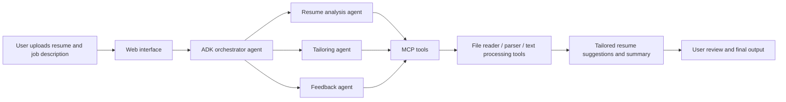

# Implementation Plan: Resume Tailor Agent

## 1. Project Goal
Build an end-to-end AI agent that helps job seekers tailor their resume to a specific role by combining reasoning, structured analysis, and tool-based document processing.

The final experience should feel like a helpful career assistant that can:
- read a resume and job description
- identify the best matching skills and experience
- rewrite bullet points for relevance
- generate a tailored summary or cover letter draft
- explain the match quality clearly

## 2. End-to-End Project Flow

## 3. Core Agent Architecture

### Agents
- Orchestrator Agent
  - receives the user request
  - decides which specialized agent should handle the task
  - coordinates the workflow

- Resume Analysis Agent
  - reads the resume content
  - extracts experience, skills, achievements, and strengths

- Tailoring Agent
  - compares the resume to the job description
  - suggests better wording, keyword alignment, and improved bullet points

- Feedback Agent
  - explains the match quality
  - offers improvement suggestions and a short cover letter draft

### Key Technologies
- Google Agent Development Kit (ADK)
- Python for orchestrating the agent workflow
- Gemini model for content analysis and rewriting
- MCP server for file and text-processing tools
- Streamlit or a lightweight web UI for uploading documents
- Optional deployment on Google Cloud Run

## 4. MCP-Based Tool Strategy
The project will use MCP to expose a small set of tools in a modular way.

### Suggested MCP Tools
- file reader tool: read uploaded resume text or documents
- parser tool: extract structured text from simple document formats
- text processing tool: clean content and prepare analysis input
- summary tool: produce a concise explanation of the fit between candidate and role

### Why MCP is Useful
MCP makes the project more extensible because new tools can be added later without changing the main agent logic. It also makes the architecture look more professional and closer to real-world agent systems.

## 5. Security and Trust Features
Since the system may process personal career documents, security and clarity are important.

### Planned Safeguards
- avoid storing sensitive personal data beyond the current session
- use environment variables for API keys and secrets
- clearly label generated suggestions as AI-generated
- keep the workflow explainable and reviewable

## 6. Development Phases

### Phase 1: Project Setup
- create the repository structure
- define the MVP use case clearly
- set up the Python environment and ADK dependencies
- configure the model and tool access

### Phase 2: Agent Foundation
- build the main orchestrator using ADK
- define agent instructions and responsibilities
- test the flow with a simple resume and job description

### Phase 3: MCP Integration
- build or connect MCP server endpoints
- expose document reading and processing tools
- verify the agent can use tools and produce structured output

### Phase 4: User Experience
- add a simple web interface for uploading files and viewing results
- present tailored bullets, summary suggestions, and a matching explanation

### Phase 5: Polish and Demo Prep
- improve prompt quality and output formatting
- add a short cover letter draft feature
- collect screenshots and a demo script for the video

### Phase 6: Deployment
- optionally deploy the app to a public environment
- prepare documentation and the Kaggle submission materials

## 7. Demo Flow for the Capstone
A strong demo should show the agent completing a realistic task such as:

User input:
- Resume: a candidate’s current resume
- Job description: a software engineering or data role

The agent should:
1. analyze the resume content
2. extract the best relevant experience and skills
3. suggest improved, role-specific bullet points
4. generate a short summary explaining the match
5. present a tailored output in a polished way

## 8. Kaggle Evaluation Alignment
This implementation plan supports the capstone requirements by demonstrating:
- a multi-agent system using ADK
- MCP-based tool integration
- a practical user-facing workflow
- security-conscious design
- deployability and clear documentation

## 9. Suggested MVP Scope
To keep the project realistic for a hackathon, the first version should focus on:
- one primary user flow
- one resume and one job description at a time
- 3–4 simple tools
- clear, useful output over broad feature coverage

## 10. Stretch Goals
If time allows, expand the project with:
- cover letter generation
- ATS keyword scoring
- multiple resume versions for different roles
- better formatting and export options
- user memory for preferences and past job targets
